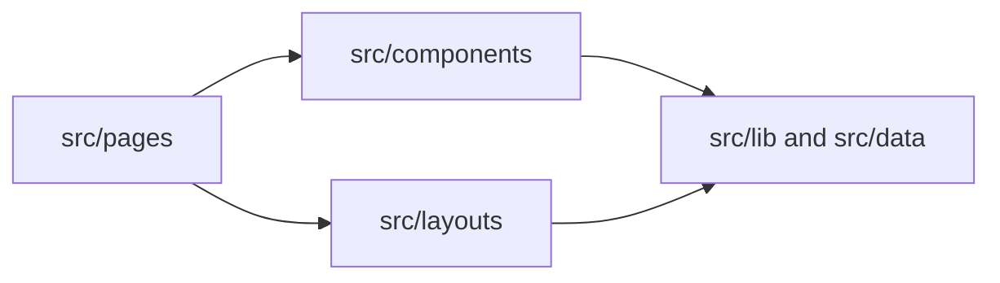

# Ploycheeze — agent guide

Concise context for AI coding agents working in this repository. Prefer pointing to existing files over duplicating long tutorials.

**Naming:** This file is `AGENT.md`. Some tools expect `AGENTS.md` at the repo root; if auto-loading fails, rename or add a short `AGENTS.md` that links here.

## Project

Portfolio / marketing site for **Ploycheeze** (default title and meta in [`src/layouts/main.astro`](src/layouts/main.astro)).

## Stack

| Area         | Choice                                                                                                                                                          |
| ------------ | --------------------------------------------------------------------------------------------------------------------------------------------------------------- |
| Framework    | [Astro](https://astro.build/) 6 + [`@astrojs/react`](https://docs.astro.build/en/guides/integrations-guide/react/)                                              |
| Language     | TypeScript — [`astro/tsconfigs/strict`](tsconfig.json)                                                                                                          |
| Styling      | [Tailwind CSS](https://tailwindcss.com/) v4 via `@tailwindcss/vite`                                                                                             |
| Deploy       | [Cloudflare](https://docs.astro.build/en/guides/deploy/cloudflare/) — `@astrojs/cloudflare`, `imageService: "compile"` ([`astro.config.mjs`](astro.config.mjs)) |
| UI kit       | [shadcn/ui](https://ui.shadcn.com/) — **base-vega** style ([`components.json`](components.json)); icons: Lucide (Phosphor also in dependencies)                 |
| Client state | [Nanostores](https://github.com/nanostores/nanostores) — [`src/lib/store.ts`](src/lib/store.ts)                                                                 |
| Carousels    | [Embla](https://www.embla-carousel.com/)                                                                                                                        |

## Repository map

- [`src/pages/`](src/pages/) — Routes (e.g. [`src/pages/index.astro`](src/pages/index.astro)).
- [`src/layouts/main.astro`](src/layouts/main.astro) — HTML shell, meta / Open Graph, global CSS import.
- [`src/components/`](src/components/) — Page sections (`.astro` under `sections/`), interactive islands (`.tsx`), shadcn primitives under `ui/`.
- [`src/lib/`](src/lib/) — Shared utilities (`utils.ts`), Nanostores (`store.ts`).
- [`src/data/`](src/data/) — Structured content (e.g. [`src/data/works.tsx`](src/data/works.tsx)).
- [`src/styles/global.css`](src/styles/global.css) — Tailwind entry and design tokens.

## Path aliases

`@/*` maps to `./src/*` ([`tsconfig.json`](tsconfig.json)). Import like `@/components/...`, `@/lib/...`.

## Patterns

- Use **Astro** for page structure and mostly-static sections; use **React** (`.tsx`) for interactive UI (sheets, carousel, custom cursor, etc.).
- New vertical sections: add under `src/components/sections/` and compose from pages (e.g. [`src/pages/index.astro`](src/pages/index.astro)) or new routes.
- **shadcn:** Respect aliases in [`components.json`](components.json). For CLI workflows and project-specific UI notes, read [`.agents/skills/shadcn/SKILL.md`](.agents/skills/shadcn/SKILL.md). Quick add: `npx shadcn@latest add <component>` (see [`README.md`](README.md)).

## Commands

From [`package.json`](package.json):

| Script                   | Purpose                                                                                                                     |
| ------------------------ | --------------------------------------------------------------------------------------------------------------------------- |
| `bun run dev`            | Dev server                                                                                                                  |
| `bun run build`          | Production build                                                                                                            |
| `bun run preview`        | Preview production build                                                                                                    |
| `bun run lint`           | ESLint on `**/*.{ts,tsx}` — Astro files are not in the current ESLint `files` glob ([`eslint.config.js`](eslint.config.js)) |
| `bun run format`         | Prettier — `ts`, `tsx`, `astro`                                                                                             |
| `bun run typecheck`      | `astro check`                                                                                                               |
| `bun run generate-types` | `wrangler types` — Worker env types when touching Workers / Wrangler                                                        |

## Architecture (high level)

## Related docs

- [README.md](README.md) — shadcn add / basic Astro usage.
- [.agents/skills/shadcn/SKILL.md](.agents/skills/shadcn/SKILL.md) — shadcn maintenance in this repo.
